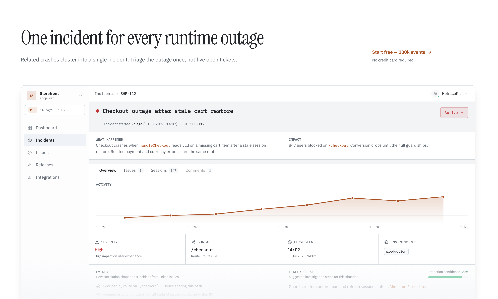

<p align="center">
  
</p>

# retrace-kit

[](https://pypi.org/project/retrace-kit/)
[](https://github.com/RetraceKit/sdk-python/blob/main/LICENSE)
[](https://pypi.org/project/retrace-kit/)

Lightweight error tracking for Python.  
Catch exceptions, attach context, and send them to [Retrace Kit](https://retracekit.cloud).

<p align="center">
  
</p>

## Features

- Auto-capture uncaught exceptions, threading errors, and asyncio loop exceptions
- Manual reporting with `capture_exception`
- Breadcrumbs, user context, and tags
- FastAPI and Django integrations
- Zero runtime dependencies in the core package
- Typed public API (Python 3.10+)

## Install

```bash
pip install retrace-kit
```

Optional framework integrations:

```bash
pip install retrace-kit[fastapi]
pip install retrace-kit[django]
```

## Python

```python
import os

from retrace_kit import init

init(
    api_key=os.environ["RETRACE_KIT_API_KEY"],
    endpoint=os.environ.get(
        "RETRACE_KIT_ENDPOINT",
        "https://api.retracekit.cloud/api/error-events",
    ),
    server_url=os.environ.get("RETRACE_KIT_SERVER_URL"),
    environment=os.environ.get("RETRACE_KIT_ENVIRONMENT"),
    release=os.environ.get("RETRACE_KIT_RELEASE"),
)
```

Requires Python 3.10+.  
Uncaught errors in the main thread, worker threads, and the asyncio event loop are reported automatically after `init`.  
Details: [Python docs](https://retracekit.cloud/docs/environments/python/) *(coming soon)*

## FastAPI

```python
import os

from fastapi import FastAPI

from retrace_kit import init
from retrace_kit.integrations.fastapi import setup_fastapi

init(api_key=os.environ["RETRACE_KIT_API_KEY"])
app = FastAPI()
setup_fastapi(app)
```

Unhandled server errors (5xx and uncaught exceptions) are reported with route breadcrumbs and request URL.  
Client errors such as `HTTPException(404)` are not reported.

See `examples/fastapi_app/main.py`.

## Django

Add middleware to `settings.py`:

```python
MIDDLEWARE = [
    # ...
    "retrace_kit.integrations.django.RetraceKitMiddleware",
]
```

Initialize the SDK in `settings.py` or `wsgi.py`:

```python
import os

from retrace_kit import init

init(api_key=os.environ["RETRACE_KIT_API_KEY"])
```

Unhandled view exceptions are captured; `Http404` and `PermissionDenied` are ignored.

See `examples/django_app/`.

## API

| Export | Description |
| --- | --- |
| `init` | Initialize with API key and options |
| `capture_exception` | Report handled errors |
| `add_breadcrumb` | Add context before an error |
| `set_user` | Attach a user id |
| `set_tag` | Set a key/value tag |
| `install_asyncio_handler` | Install asyncio loop exception handler |
| `setup_fastapi` | Register FastAPI exception handlers (`retrace_kit.integrations.fastapi`) |
| `RetraceKitMiddleware` | Django middleware (`retrace_kit.integrations.django`) |

```python
import os

from retrace_kit import (
    add_breadcrumb,
    capture_exception,
    init,
    set_tag,
    set_user,
)

init(
    api_key=os.environ["RETRACE_KIT_API_KEY"],
    environment="production",
    release="1.2.3",
)

set_user({"id": "user_123"})
set_tag("plan", "pro")
add_breadcrumb(
    type="common",
    name="checkout",
    value="started",
)

try:
    checkout()
except Exception as error:
    capture_exception(error)
```

## Documentation

**https://retracekit.cloud/docs/**

Repository: [github.com/RetraceKit/sdk-python](https://github.com/RetraceKit/sdk-python)

## Development

```bash
pip install -e ".[dev,fastapi,django]"
pytest
ruff check src tests
mypy src/retrace_kit
python -m build
```

## License

Apache-2.0
